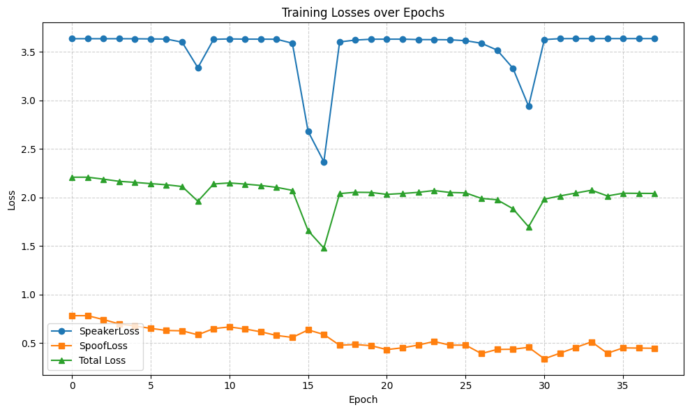

# 100 samples

## Audio encoder, both speaker and spoofing module
Not good, reaally, look at logs/traintorch_testsmall_20250921-081522.txt, or this graph right here:


Experiment ran on google collab, T4 Telsa GPU.
Model details:
- Input: sample rate is 1600, number of samples for FFT is 400, hop length is 160, fixed 4 seconds audio length, total sample is 1600, 1 second of audio fits 10 frames
- Stemming: 2 convolution 1D, Gelu activation, no positional encoding
- AudioEncoder: 8 layers of multi-head attention of 8 heads, hidden dimension is 128, context length is 1024 (i think its wrong)
- SpeakerEmbedding: 3 layers of MMA, sames as above. Then mean pooling across context dimension (output is 128) (i think its wrong here also, should be pooling first, then MLP)
- Spoofing: maximum pooling cross context dimension, then 3 MLP of outputs shape 64, 32, and 2, gelu activation. (i think there should be only 2 MLP)
- Loss function: self-CLIP loss function for speaker embeddings, cross entropy for spoofing
- Optimizer: AdamW, learning rate is 1e-3, eps is 1e-8, weights decay is 0.01. 
- Scheduler: cosine schedule with warmup
- Took nearly 12GB when training

```bash
%cd /content/HalfWhipResult

!python -m test.traintorch_testsmall \
  --metadata_path /content/metadatas/metadata_small_train.csv \
  --prefix /content/vsasv_reorganized/content/vsasv_reorganized \
  --batch_size 128 \
  --epochs 39 \
  --device cuda \
  --lr 1e-3 \
  --eps 1e-8 \
  --weight_decay 0.01 \
  --n_mels 80 \
  --n_audio_ctx 1024 \
  --n_audio_state 128 \
  --n_audio_head 8 \
  --n_audio_layer 8 \
  --n_spkemb_layers 3
```

What's next?
- Embedding and spoofing should be sperated
- Fixing audio parameters (sample rates, hop size, fft, audio length, context length for models)